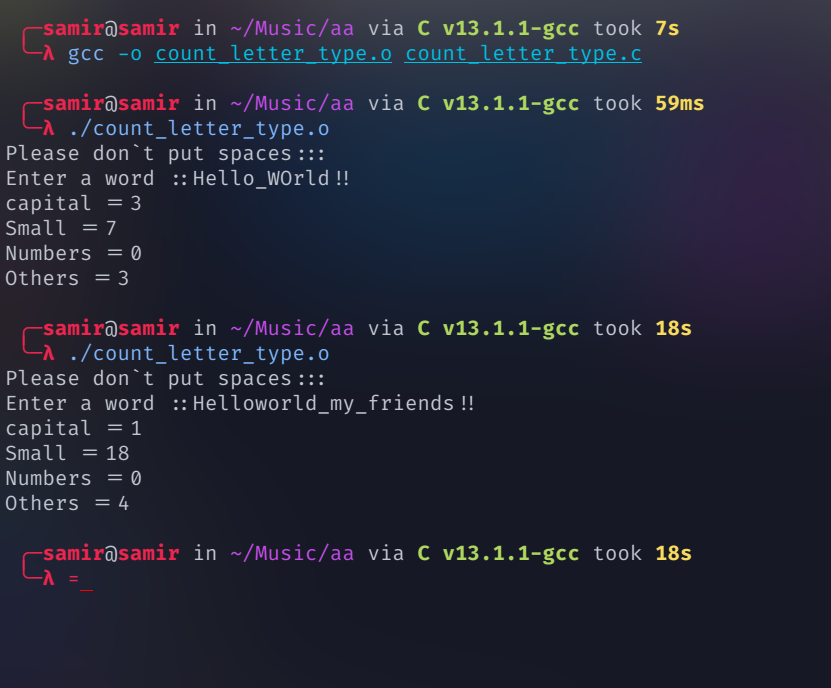

<h1 align="center">

[](https://samirgaire10.github.io/Portfolio/)
</h1>


<p align="center">A tech enthusiast with a passion for open-source technology and programming  languages like Python and C .</p>


# count_letter_type
count letter type


## Run Locally

Clone the project

```bash
  git clone https://github.com/samirgaire10/count_letter_type.git
```

Go to the project directory

```
  cd count_letter_type 
```


Compile the C file  
```
gcc -o count_letter_type.o count_letter_type.c
```

Run
```
./count_letter_type.o
```


[](https://github.com/samirgaire10)

[](https://github.com/samirgaire10)


## 🚀 About Me

- 👨‍💻 My Github is available at [Github](https://github.com/samirgaire10)
- 👨‍💻 My Portfolio is available at [Portfolio](https://samirgaire10.github.io/Portfolio/)
- 👨‍💻 My projects  Library are available at [Library](https://samirgaire10.github.io/Library/)
- 👨‍💻 My Highschool projects are available at [HighSchool projects](https://samirgaire10.github.io/High-School-Web-Projects/)
- 👨‍💻 My Kamata projects are available at [ 日本工学院専門学校蒲田 projects](https://samirgaire10.github.io/kamata/)


<h3 align="left">Languages:</h3>
<p align="left"> <a href="https://www.cprogramming.com/" target="_blank" rel="noreferrer">   </a> </p>



